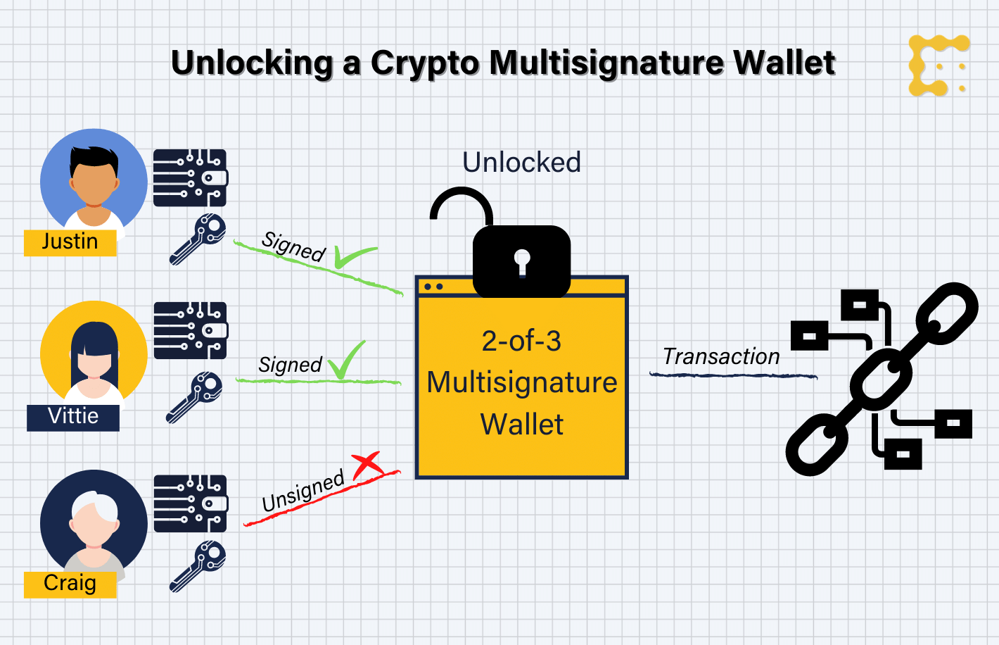

# MultiSig wallet

- This is a simple multi-signature wallet that allows you to create a wallet with multiple owners and require multiple signatures to send funds.

---

- [x] Create a wallet with multiple owners
- [x] Setup transaction limit
- [x] Setup daily transaction limit
- [x] Create a transaction
- [x] Approve a transaction
- [x] Deny a transaction
- [x] Execute a transaction
- [x] Revoke a transaction
- [x] Get all transactions with their status (PASSED, FAILED, PENDING)

== X ==